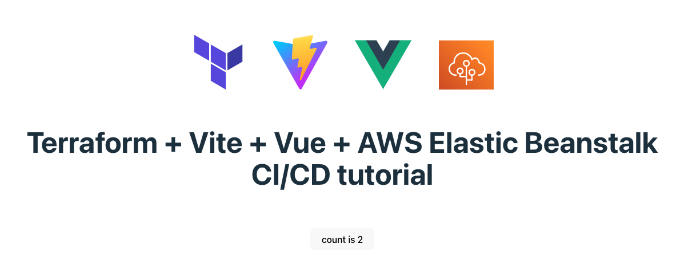

# Terraform + Vite + Vue + AWS Elastic Beanstalk CI and CD tutorial



## Prerequisites
Terraform
AWS Account
AWS cli
npm 9.7.2 or latest version

## Installing Vite + Vue
```bash

npm create vite@latest

Need to install the following packages:
  create-vite@4.3.2
Ok to proceed? (y) y
✔ Project name: … vueapp
✔ Select a framework: › Vue
✔ Select a variant: › TypeScript

cd vueapp
npm install
npm run dev

npm install -g npm@9.7.2
```
